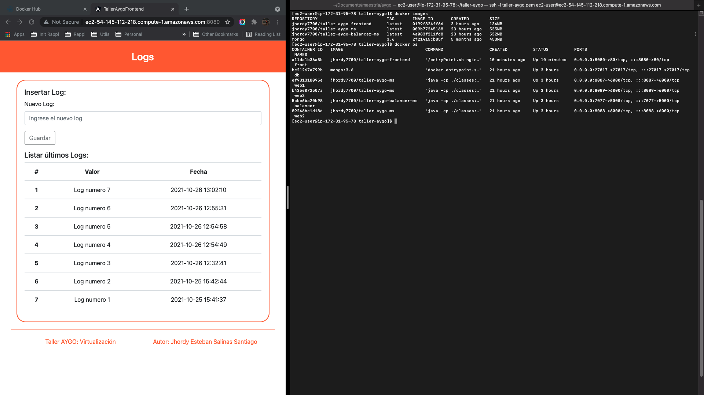
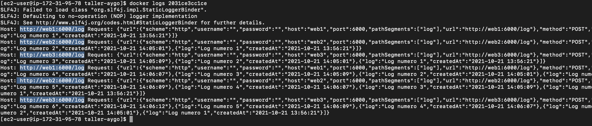
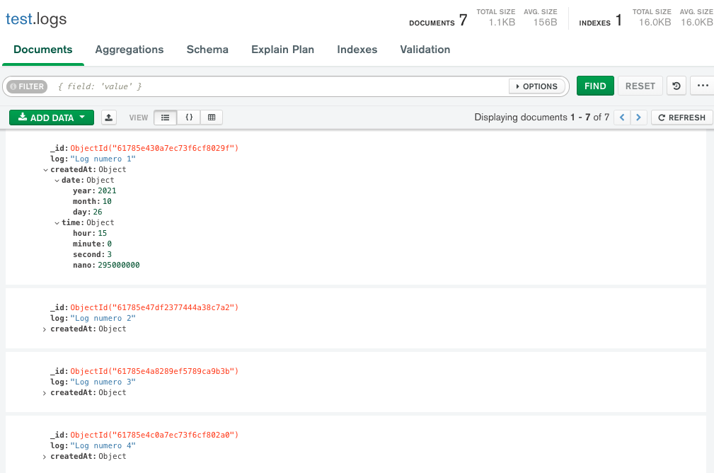
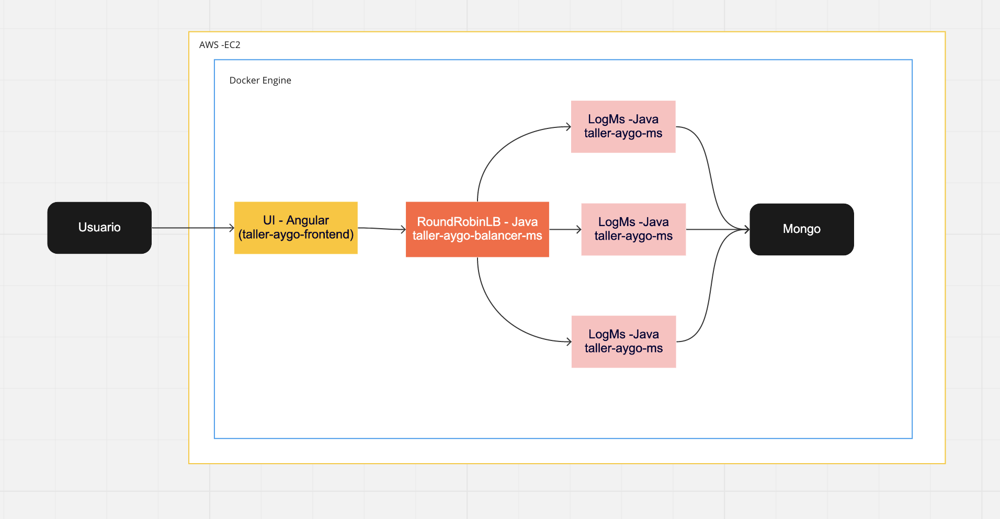

# taller-aygo
TALLER DE INTRODUCCIÓN A VIRTUALIZACIÓN Y PROG. DISTRIBUIDA

### Resumen
El proyecto de este repositorio consiste en desarrollar componentes para un sistema de loggeo
El proyecto tiene 3 carpetas que describo a continuacion:

- taller-aygo-ms (Java): Es el microservicio encargado de la conexion al mongo y realizar la insercion y consulta de los ultimos 10 logs.
- taller-aygo-balancer-ms (Java): Es el microservicio encargado del papel de balanceador, el cual entrega las requests que se le hacen de manera turnada a cada uno de los contenedores con la imagen del ms anterior.
- taller-aygo-frontend (Angular): Es la interfaz para el usuario, encargada de consumir el balancer y poder atender al caso de uso del cliente.

### Generar las imagenes para desplegarlo

En el actual proyecto e encuentran dos yml:

- docker-compose-local.yml: Fue el yml con el que construi las imagenes actuales, que posteeriormente subi al repo de docker hub para que pudiesen utilizarse
- docker-compose.yml: Es el yml que puede usarse desde cualquier maquina con docker para poder obtener y levantar las imagenes (que es el que use en la maquina EC2 de aws)

El docker-compose.yml si desean construirlo apartir de las imagenes de docker hub es:

```
version: '2'
services:
  front:
    image: jhordy7700/taller-aygo-frontend
    container_name: front
    environment:
      - BACK_API=http://ec2-54-145-112-218.compute-1.amazonaws.com:7077/balancer/log
    ports:
      - 8080:80
  balancer:
    image: jhordy7700/taller-aygo-balancer-ms
    container_name: balancer
    environment:
      - LOG_HOSTS=http://web1:6000,http://web2:6000,http://web3:6000
    ports:
      - 7077:5000
  web3:
    image: jhordy7700/taller-aygo-ms
    container_name: web3
    environment:
      - MONGODB_USERNAME=aygo
      - MONGODB_PASSWORD=secret
      - MONGODB_HOST=db
      - MONGODB_PORT=27017
      - MONGODB_DB=test
    ports:
      - 8089:6000
  web2:
    image: jhordy7700/taller-aygo-ms
    container_name: web2
    environment:
      - MONGODB_USERNAME=aygo
      - MONGODB_PASSWORD=secret
      - MONGODB_HOST=db
      - MONGODB_PORT=27017
      - MONGODB_DB=test
    ports:
      - 8088:6000
  web1:
    image: jhordy7700/taller-aygo-ms
    container_name: web1
    environment:
      - MONGODB_USERNAME=aygo
      - MONGODB_PASSWORD=secret
      - MONGODB_HOST=db
      - MONGODB_PORT=27017
      - MONGODB_DB=test
    ports:
      - 8087:6000
  db:
    image: mongo:3.6
    container_name: db
    environment:
      MONGO_INITDB_ROOT_USERNAME: aygo
      MONGO_INITDB_ROOT_PASSWORD: secret
    ports:
      - 27017:27017
    command: mongod

volumes:
  mongodb:
  mongodb_config:
```

El comando usado para la construccion de las imagenes y sus contenedores es pararse en la carpeta que contenga el docker-compose.yml y ejecutar:

`docker-compose up --build -d`

Tambien use diferentes comandos de docker para interactuar tanto con imagenes como contenedores tales como

`docker images`
`docker ps -a`
`docker logs <conatiner_id>`

### Imagenes de despliegue

- Aplicacion en AWS



- Funcionamiento interno del balancer



- Db



### Arquitectura de la solucion

La solucion para la aplicacion de loggeo consiste en un contenedor de una imagen de front desarrollada en angular, el cual consume un contenedor de una imagen que representa un balancer desarrollado en Java, este balancer a su vez consume bajo la tecnica de distribucion de carga Round Robin a 3 contenedores de una misma imagen encargados de la logica de insercion y consulta de un datasource de mongo, finalmente dicho datasource tambien esta en un contenedor que se construye de una imagen publica de mongo. 

